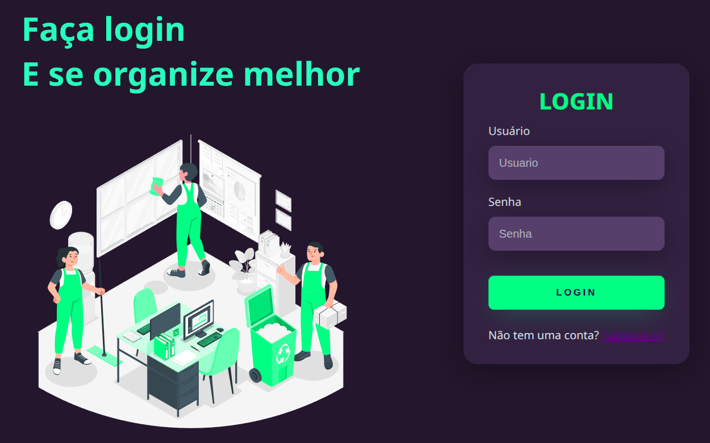
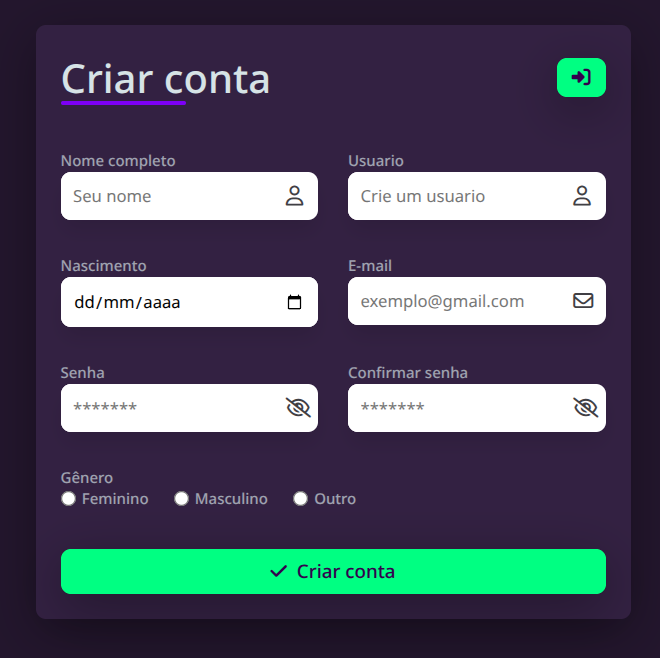
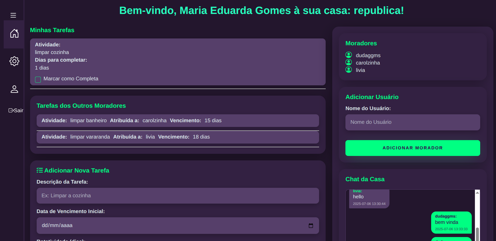
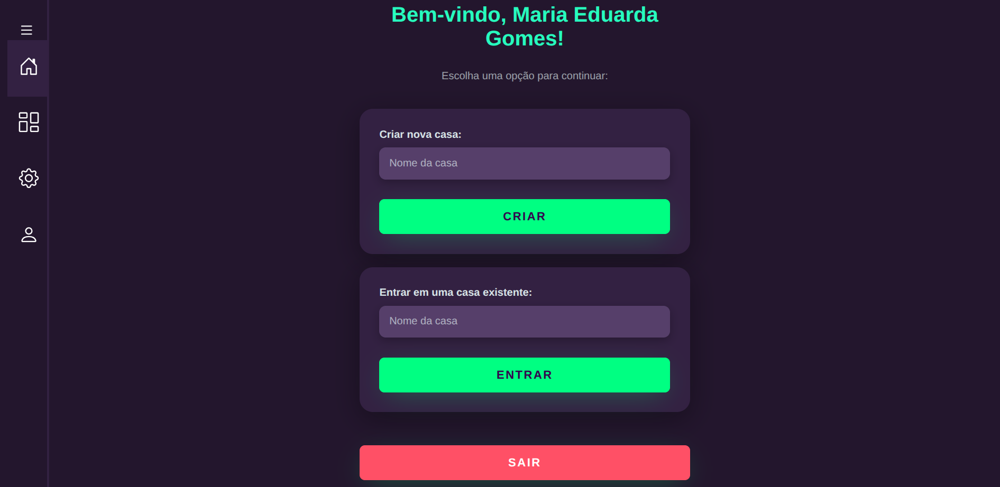
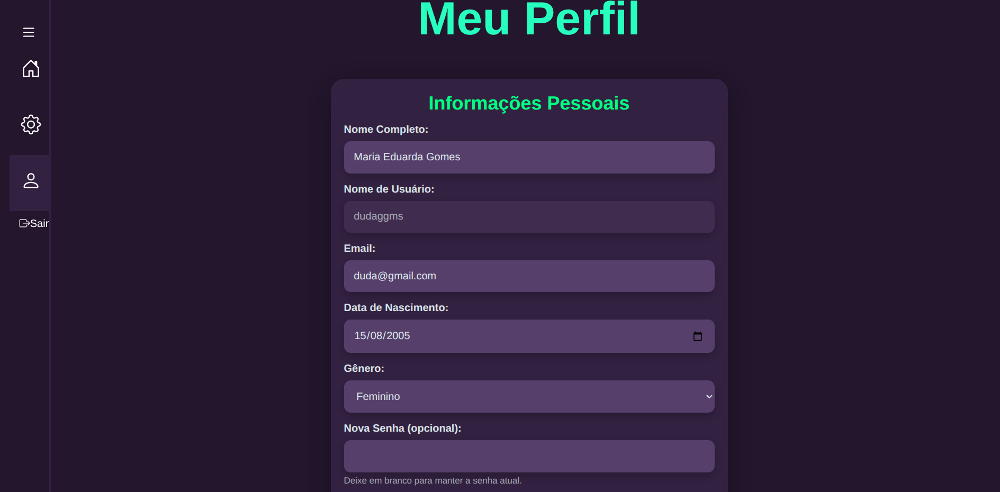

# 🏠 Projeto House - Gerenciador de Tarefas Domésticas

> **Solução para o caos organizacional em repúblicas e casas compartilhadas**

Uma aplicação web que transforma a convivência em repúblicas em algo **organizado, justo e transparente**. Inspirado em um problema real do dia a dia, o Projeto House automatiza a distribuição de tarefas domésticas, elimina conflitos sobre quem faz o quê e facilita a comunicação entre moradores através de um chat integrado.

---

## 📋 Índice

- [Sobre o Projeto](#sobre-o-projeto)
- [Funcionalidades](#-funcionalidades)
- [Tecnologias](#-tecnologias)
- [Como Começar](#-como-começar)
  - [Pré-requisitos](#pré-requisitos)
  - [Instalação](#instalação)
- [Como Usar](#-como-usar)
- [Estrutura do Projeto](#-estrutura-do-projeto)
- [O Problema que Resolve](#-o-problema-que-resolve)
- [Créditos](#-créditos)

---

## Sobre o Projeto

### 🎯 A História

Morar em república é incrível, mas a organização das tarefas domésticas sempre foi um caos. Quem faz a limpeza? Quando o banheiro vai ser limpo? Por que ninguém lava a louça? Essas perguntas frequentes criaram tensão entre os moradores.

**A solução?** Um software inteligente que:
- ✅ Distribui tarefas de forma **automática e rotativa**
- ✅ Define responsáveis com **clareza total**
- ✅ Rastreia o status das tarefas em tempo real
- ✅ Oferece um **chat exclusivo** para comunicação harmoniosa

Desenvolvido como projeto final de **Orientação a Objetos** na Universidade de Brasília, o Projeto House prova que tecnologia pode resolver problemas reais do cotidiano.

---

## ✨ Funcionalidades

### 🔐 Autenticação Segura
- Cadastro e login com senhas criptografadas usando `bcrypt`
- Edição de perfil e exclusão de conta
- Sistema seguro de gerenciamento de sessão

### 🏘️ Gerenciamento de Casas
- **Criar uma nova casa** (república, apartamento compartilhado, etc.)
- **Entrar em uma casa existente** através de um código ou nome único
- **Adicionar ou remover membros** da casa
- Visualizar todos os moradores e suas responsabilidades

### 📝 Sistema Inteligente de Tarefas
- ➕ Adicionar tarefas com **data de vencimento** clara
- 🔄 **Rotação Automática:** A tarefa passa automaticamente para o próximo morador após o vencimento (você define a periodicidade em dias)
- ✔️ Marcar tarefas como concluídas
- 📊 Acompanhar histórico de quem fez o quê e quando
- Notificações visuais de tarefas vencidas ou próximas do vencimento

### 💬 Chat em Tempo Real
- **Bate-papo exclusivo** para membros da casa usando **WebSockets**
- Comunicação instantânea sem necessidade de atualizar a página
- Histórico de mensagens persistido

### 🎨 Interface Intuitiva
- Design **responsivo** (funciona em celular, tablet e desktop)
- **Tema escuro** para conforto visual
- Feedback visual interativo (animações de erro, validações de formulário)
- UX centrado na simplicidade e usabilidade

---

## 📸 Screenshots

<div align="center">

**Autenticação**

 | 
---|---

**Dashboard Principal**



**Gerenciamento de Casa e Perfil**

 | 
---|---

**Comunicação em Tempo Real**


</div>

---

## 🛠️ Tecnologias

### Backend
- **Python 3.x** — Linguagem principal
- **Bottle** — Micro web-framework leve e rápido
- **Python-SocketIO** — WebSockets para chat em tempo real
- **Eventlet** — Servidor WSGI assíncrono (suporta múltiplas conexões simultâneas)
- **Bcrypt** — Criptografia segura de senhas

### Frontend
- **HTML5** — Estrutura semântica
- **CSS3** — Layout com Flexbox e design responsivo
- **JavaScript** — Sem dependências externas, código puro
- **Socket.IO Client** — Cliente WebSocket para chat

### Banco de Dados
- **JSON** — Armazenamento baseado em arquivos (NoSQL-like structure)
  - Persistência simples e rápida
  - Fácil de ler e depurar
  - Ideal para protótipos e MVPs

---

## 📂 Estrutura do Projeto

```
projeto-house/
├── app/
│   ├── controllers/
│   │   ├── application.py
│   │   ├── datarecord.py
│   │   └── db/
│   ├── models/
│   ├── static/
│   │   ├── css/
│   │   ├── js/
│   │   └── img/
│   └── views/
├── img/
├── main.py
├── requirements.txt
└── README.md
```

---

## 🚀 Como Começar

### Pré-requisitos

- **Python 3.x** (recomendado Python 3.9+)
- **pip** (gerenciador de pacotes Python)

### Instalação

#### 1️⃣ Clone o repositório

```bash
git clone https://github.com/eduarda-ogomes/projeto-house.git
cd projeto-house
```

#### 3️⃣ Instale as dependências

```bash
pip install -r requirements.txt
```

Ou instale manualmente:
```bash
pip install bottle python-socketio eventlet bcrypt
```

#### 4️⃣ Execute a aplicação

```bash
python main.py
```

✅ O servidor iniciará em `http://localhost:8080`

Acesse no seu navegador e comece a organizar sua república!

---

## 💡 Como Usar

### Fluxo Básico

1. **Crie uma conta** → Registre-se com email e senha
2. **Crie ou entre em uma casa** → Crie uma nova república ou entre em uma existente
3. **Adicione tarefas** → Defina tarefas, datas e periodicidade de rotação
4. **Acompanhe responsabilidades** → Veja quem é responsável por cada tarefa
5. **Complete tarefas** → Marque como concluído quando terminar
6. **Comunique-se** → Use o chat para coordenar atividades

---

## 🤔 O Problema que Resolve

### Antes do Projeto House 😰

- ❌ "Quem foi que não fez a louça?"
- ❌ "Não foi minha vez de limpar o banheiro!"
- ❌ "Ninguém sabe quando cada um vai limpar"
- ❌ Discussões e brigas sobre responsabilidades
- ❌ Falta de transparência nas tarefas
- ❌ Comunicação desorganizada (mensagens perdidas em grupos)

### Depois do Projeto House ✨

- ✅ **Clareza total:** Cada um sabe exatamente suas responsabilidades
- ✅ **Rotação automática:** O sistema não "esquece" de quem é a vez
- ✅ **Justiça:** Todos fazem o mesmo número de tarefas
- ✅ **Comunicação centralizada:** Chat da casa para tudo organizado em um lugar
- ✅ **Rastreabilidade:** Histórico de quem fez o quê e quando
- ✅ **Harmonia:** Menos conflitos, mais convivência

---

## 📚 Aprendizados

Este projeto foi desenvolvido como **Projeto Final** de **Orientação a Objetos** e demonstra:

- ✅ Aplicação de **padrões OOP** (classes, herança, encapsulamento)
- ✅ Desenvolvimento **full-stack** em Python
- ✅ Integração de **WebSockets** para comunicação em tempo real
- ✅ Segurança (criptografia de senhas com bcrypt)
- ✅ Persistência de dados com arquivos JSON

---

## 🔜 Funcionalidades Futuras

- 📱 Aplicativo mobile (React Native ou Flutter)
- 🔔 Notificações push para tarefas vencidas
- 📊 Dashboard com estatísticas (quem fez mais tarefas, etc)
- 📅 Calendário interativo de tarefas
- 🎯 Sistema de pontos/gamificação (badges, conquistas)
- 💾 Integração com banco de dados relacional (PostgreSQL/MySQL)
- 🌐 Deploy na nuvem

---

## 💜 Créditos

Desenvolvido por:
- **Duda** ([eduarda-ogomes](https://github.com/eduarda-ogomes))
- **Rodrigo** ([RodrigoDutraF88](https://github.com/RodrigoDutraF88))

**Universidade:** Universidade de Brasília (UnB)  
**Disciplina:** Orientação a Objetos  
**Data:** 2026

### Inspiração

Este projeto nasceu de um problema real: a dificuldade de organizar tarefas em uma república. A ideia é simples, mas poderosa — usar tecnologia para resolver um problema cotidiano e melhorar a qualidade de vida de quem compartilha um espaço.

---

<div align="center">

**Transformando repúblicas caóticas em lares organizados! 🏠✨**

[⭐ Deixe uma estrela se gostou!](https://github.com/eduarda-ogomes/projeto-house)

</div>